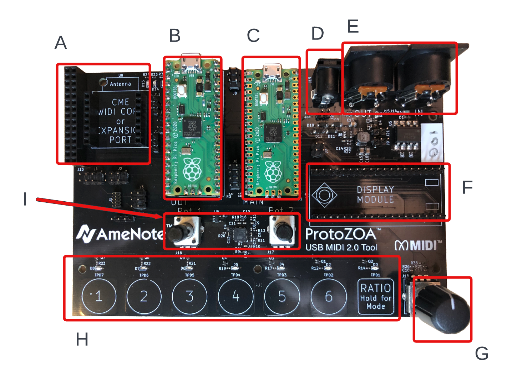
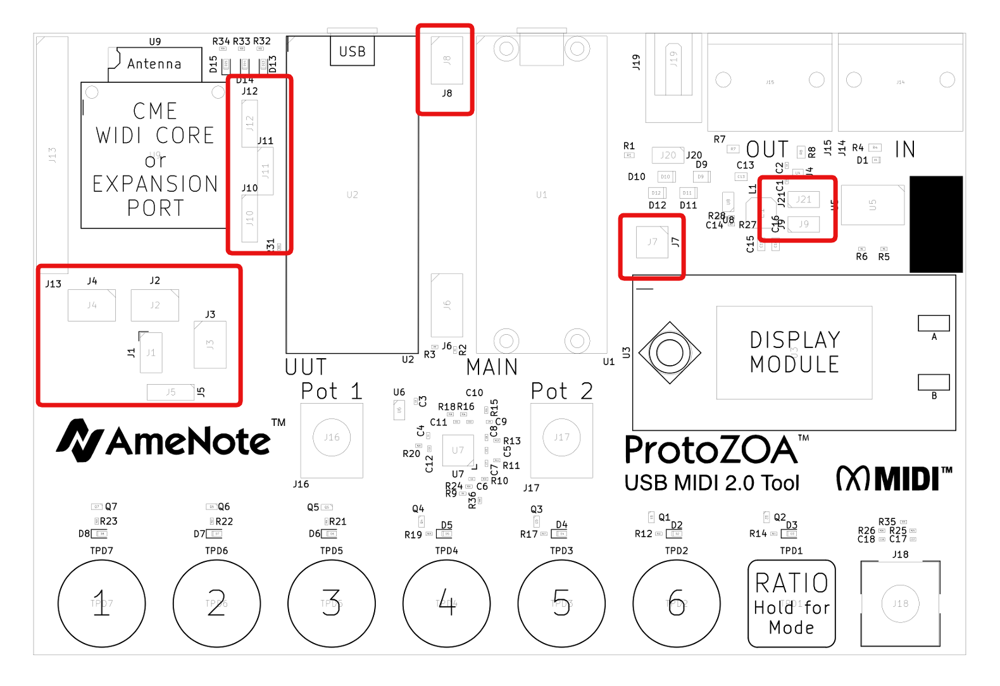

# Getting Started with ProtoZOATM

Welcome to the world of ProtoZOA: <strike>USB MIDI 2.0 Tool</strike> MIDI 2.0 Prototyping Tool. We are excited to have you join the community, evolving and integrating MIDI 2.0 and eventually creating and launching great products with MIDI 2.0 and supporting the MIDI Logo.

To get started prototyping and developming MIDI 2.0 (and contributing to the community), please review and follow the quick start guide below.

## What You Will Need / What You Should Know
**Hardware:**
- 1 x ProtoZOA MIDI 2.0 Prototyping Tool
- 2 x Micro USB cables with appropriate connection for your computer / device (not supplied with ProtoZOA)
- Optional:
	- [Waveshare Pico LCD 1.14 Display Module](https://www.waveshare.com/wiki/Pico-LCD-1.14)*1 (available from [Digikey](https://www.digikey.com/en/products/detail/seeed-technology-co-ltd/103030400/14317043), [Amazon](https://www.amazon.com/Waveshare-1-14inch-Raspberry-Embedded-Interface/dp/B08XK49TWM/ref=sr_1_5?crid=1NQ3AASEY5H6P&keywords=pico+display+module&qid=1656823583&sprefix=pico+display+module%2Caps%2C104&sr=8-5) and others)
	- [CME WIDI Core BLE Module](https://www.cme-pro.com/product/widi-core/)
	- Micro USB OTG to USB-A Host Adapter*2 (available from [Digikey](https://www.digikey.com/en/products/detail/adafruit-industries-llc/1099/5875794) and others)

**Computer:**

A computing platform to interact with ProtoZOA with is needed. Prototyping and Development is recommended on a desktop or laptop computer.
- Windows, Linux, Macintosh (currently only Mac running MacOS Monteray will connect with USB MIDI 2.0, however ProtoZOA does provide for prototyping and development using USB CDC Serial, see User Guide for more information)
- iPhone, iPad, Android - ?OS versions?

**Software:**
- IDE and GDB Debugger*3 - see [Raspberry Pi Pico documentation](https://www.raspberrypi.com/documentation/microcontrollers/raspberry-pi-pico.html) for more details.
- [MIDI 2.0 Workbench](https://github.com/midi2-dev/MIDI2.0Workbench) - a multi-platform tool to aid in prototyping and testing of MIDI 2.0.
- ProtoZOA Release Files: ProtoZOA Main, UUT and UUT_FreeRTOS. (in release directory of [Project GitHub](https://github.com/midi2-dev/Amenote_Protozoa))
- Serial terminal software.

User should be fairly proficient on the use and operation of computing platform including the connecting and using of USB devices including how to copy files to external HDD (for loading firmware to Raspeberry Pi Pico's).

Developers, particularly contributors should be fairly familiar with use of IDE's, debuggers, programming in C and C++ as well as using git (in particular github).

## ProtoZOA Overview

### Connectors / Interfaces

| Ident.  | Description  |
|:----------|:----------|
| A    | Expansion Connectors J13 and U9. J13 provides access to various power and available GPIO Pins from UUT Pico. U9 is the Expansion Port for various communication modules and is compatible with the CME WIDI Core Module.    |
| B    | The Unit Under Test (UUT) Pico. This is the Raspberry Pi Pico in which most prototyping will occur and has direct connection to the expansion connectors, the MIDI DIN ports and a high speed connection to the Main Pico which provides various inputs and diagnostics capabilities. The UUT Pico is also capable of being connected to SWD debug pins from the Main Pico for direct GDB connection.    |
| C | The Main Pico responsible for driving most interfaces on the ProtoZOA. Has monitor and control of: Display Module, Analog Potentiometers (x2), Rotary Encoder and capacitive touch buttons and LEDs. Also provides the SWD connection to UUT Pico and a console UART port accessed through the USB Device port using PicoProbe utility. |
| D | External power supply. Although the device can easily be powered by USB through either the UUT or Main Picos, the ProtoZOA can operate standalone or with higher power demand using an external DC Power Supply. See User Manual for more details and use. |
| E | MIDI Out and In DIN ports supporting standard MIDI 1.0 DIN through connected UART to UUT Pico. |
| F | Display Module connector supporting a 1.14 inch display plus additional action buttons and joystick. Controlled and monitored by the Main Pico |
| G | Endless Rotary Encoder - monitored through the Main Pico. |
| H | Cap touch buttons and respective LED indicators. 7 in total used to provide MIDI events and configuration setting (future). Monitored and controlled by Main Pico. |
| I | Two analog potentiometers providing scalled inputs for use as MIDI controllers. Monitored by the Main Pico. |

### Jumpers / Default Settings

ProtoZOA is setup to provide high flexiblity through header jumper settings. More details can be found in the User Manual. The following is a list of the default jumper settings for expected normal operation of the ProtoZOA and is as shipped. Refer to above image for location of jumper locations of interest and also position of pin 1. Note that if a jumper is not mentioned below, it is either not used or has no jumpers set by default.

SWD Debug Config from Main to UUT Pico:
- J2: 1-2
- J3: 1-2

Spare Jumpers:
- J4: 3 jumpers as spare not bridging, hanging off one end.

CME Reset Line:
- J5: 1-2

Display Reset Line:
- J7: 1-3

Console UART from UUT to Main Pico:
- J8: 1-3, 2-4

High Speed SPI Connection between Main and UUT Pico:
- J10: 1-2
- J11: 2-3
- J12: 2-3

5V Power Share / Bridge from regulator:
- J9: 1-2 (VP_5V_MAIN)
- J21: 1-2 (VP_5V_UUT)

## Getting Started

As with most, we are sure you want to jump right in and start to experiment. The following steps should help to get you going.

1. With a micro USB cable and available port connected to your computer in hand along with the ProtoZOA (configured with default jumper settings above).
2. Install optional Display and Expansion module such as the CME WIDI Core if you have them. We have tried to indicate orientation on PCB silk screen for your convenience. Ensure that pins are lined up correctly with connector. Set module on top of connector and gently press module into place. Does not take much force. If you must remove module, be sure to gently grab module on both sides and lightly rock the module essentially lifting the module evenly up from the ProtoZOA board to ensure pins will not be bent.
2. Update firmware on your Main Pico by plugging in USB port with pico boot select button pressed. Your computer should have a drive installed labelled "RPI-RP2" or similar. Copy the "ProtoZOA_Main.uf2" from the Releases directory to the Main Pico. Pico will restart automatically after download. If you have a display, the AmeNote logo should be displayed.

3. Leaving the USB cable plugged in, verify code operation by opening your serial terminal and confirming the PicoProbe serial port is available. Connecting to serial port will not yeild results until the UUT Pico is loaded.
4. Unplug the USB cable from Main Pico and plug into UUT Pico with the UUT Pico Bootsel button depressed. **Note:** It is important that neither external power or other Pico is plugged in as having existing power on ProtoZOA will not allow Pico to enter into bootloader mode.

5. Update firmware on UUT Pico by copying file "ProtoZOA_UUT.uf2" from Releases directory to the drive labelled "RPI-RP2" or similar. Pico should reboot. If you have a CME WIDI Module, you should see some LED activity on the device.
6. Unplug USB from UUT Pico and plug back into Main Pico. Using serial terminal, connect to serial port with "PicoProbe" in name (note on some OSs you will need to search to figure out correct USB port). 115200, 8-N-1 is an acceptable configuration for using this console port. On Mac, setting RTS and DTR automatic is needed and it is useful to have Local Echo as well.
7. Turn knobs, press cap touch buttons and press buttons and joystick on display if equiped. Your should see response messages on your terminal window. Nothing special, but this confirms operation.
8. Using second micro USB cable and spare port on computer or other target computing device, connect the UUT Pico to device.
9. Launch the MIDI Workbench. Configure MIDI Workbench to communicate with ProtoZOA and refresh the capability inquiry (NOTE: This is still being worked on!)

The ProtoZOA is now ready to be used for Prototyping, testing and development. We look forward to your comments, suggestions and most important your contributions. Be sure to check out the User Guide and the Developer Guide for more information.

#### Footnotes:

| #  | Footnote  |
|:----------|:----------|
| 1 | Currently the display module has no particular use and only displays the AmeNote Logo. However, it is intended to provide easier access to further functionality as well as being a display to developers to provide feedback on their prototyping efforts. |
| 2 | By using this adapter, the Main or UUT Pico can be adapted to being a USB Host. Currently AmeNote does not provide any USB Hosting capabilities but intends to eventually provide binaries (license TBD) to enable hosting of USB MIDI 1.0 or USB MIDI 2.0 Class compliant devices. |
| 3 | IDE and debugger only needed if you intend to prototype, develop and contribute to ProtoZOA MIDI 2.0 Prototype community. |

##### AmeNote, AmeNote Logo and ProtoZOA are trademarks of AmeNote Inc., 2022.
##### Copyright (c) AmeNote Inc., 2022.

