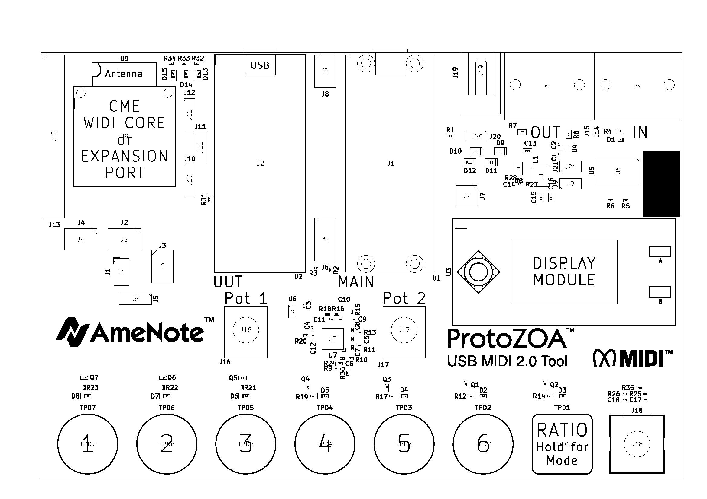
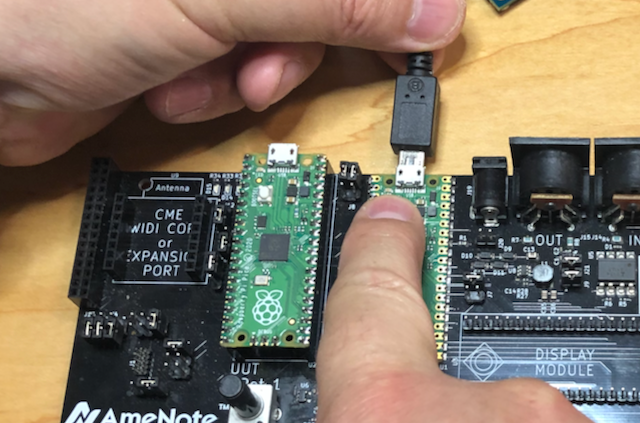
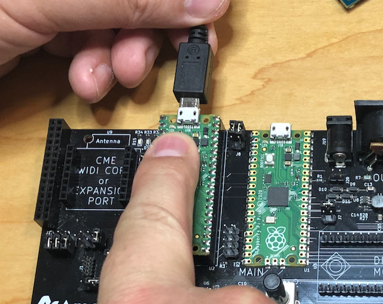
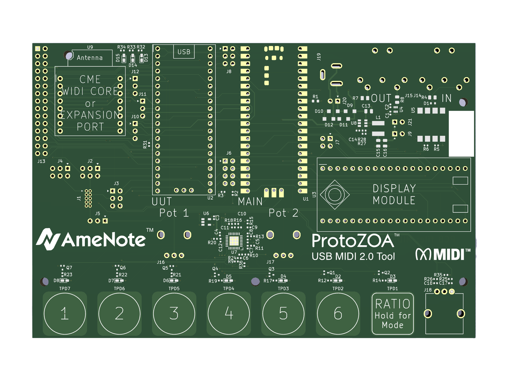

# ProtoZOATM User Manual

     AmeNote ProtoZOA Pictured with Optional CME WIDI Core and Display Module

The ProtoZOA by AmeNote is a MIDI 2.0 Protyping Tool for developers and integrators of hardware, software and drivers. The design inlcuding source is open to commercial members of the MIDI Association with the intention to have association members utilize a common platform to integrate MIDI 2.0 with common architectures, protocol implementations with broad industry participation - a mission goal of the MIDI Association.

Additional ProtoZOAs may be purchased from AmeNote directly for $250.00 USD plus shipping by contacting us at [info@AmeNote.com](mailto:info@AmeNote.com). We build the ProtoZOAs in batches and therefore will let you know timeline to receive your order. We will invoice you when we are ready to ship the ProtoZOA(s) to you.

## Introduction

The ProtoZOA is intended to be a MIDI Association Community development, integration and test tool. By supplying all MIDI Association Member companies with a ProtoZOA and having the source as open to the MIDI Association members (see [License](https://github.com/midi2-dev/Amenote_Protozoa/blob/main/License.md) details), the Community can work together on consistently advancing MIDI 2.0 and its features.

The highly flexible ProtoZOA platform provides:
- A well documented, simple and yet powerful embedded development MCU core (RP2040) on a easily attainable evaluation and if desired product integratable platform, the Raspberry Pi Pico. (see the [Raspberry Pi Pico](https://www.raspberrypi.com/products/raspberry-pi-pico/) information pages for more details of the Pico, documentation and development resources). This is known as the UUT Pico (Unit Under Test). The UUT Pico provides the following resources:
	- A micro USB port providing USB Device or Host connectivity. Provided source includes device configuration for operating as a USB MIDI 2.0 device with fallback to USB MIDI 1.0 as well as a CDC UART interface.
	- A MIDI DIN In / Out Pair where the general purpose pins can be switched to the expansion connector J13 through jumper settings.
	- A specialized expansion port (U9) configured to be able to use the optional [CME WIDI Core ](https://www.cme-pro.com/product/widi-core/) BLE Module or other optional modules which AmeNote and others will be releasing over time.
	- A general expansion connector (J13) which provides several general purpose interface pins from the UUT Pico as well as the ability to supply power to the ProtoZOA board and receive power from the onboard regulators.
	- Jumper settable links to the Main UUT supplying a console UART, high speed SPI communications and a optional SWD debugger connection to debug the Main Pico (configured PicoProbe firmware is required).
- The Main Pico which provides the following resources:
	- A dedicated SWD debug link to the UUT Pico.
	- A jumper settable console UART link to the UUT Pico.
	- A jumper settable high speed SPI link to the UUT Pico
	- A cap touch interface with 6 operational touch pads plus an additional configuration / option pad.
	- Two analog potentiometers for scaled inputs.
	- A rotary encoder for limitless rotational data input.
	- An interface to an optional display board providing a user interface, joystick with center button and two additional function buttons.

The community, in conformance to the license, is welcome to use the provided reference materials and source code for their own prototyping, testing, and certification efforts. In addition, the design may be utilized in their own products or services, again in conformance to the license.

AmeNote and the MIDI Association desires that members will contribute to and evolve the ProtoZOA platform and looks forward to your active participation in the [forum discussions](https://discuss.midi.org/c/midi2wg/protozoa/28) and the project [git](https://github.com/midi2-dev/Amenote_Protozoa).

The following is intended to provide general information on the use and configuration of the ProtoZOA. We welcome any suggestions to updates to this document through the forum.

## ProtoZOA Board Layout

The following table provides details of all key interface points of the ProtoZOA in reference to the board layout picture above.

| Identifier  | Function  | Description  |
|:----------|:----------|:----------|
| U1    | Main Pico    | The Main Raspberry Pi Pico, a highly flexible development board. Controls main board interfaces and provides UART and SWD debugging interface to the UUT Pico.|
| U2 | UUT Pico | The Unit Under Test (UUT) Pico, a second highly flexible development board. Intended to be main prototyping device interfacing to standard MIDI, USB and expansion connector as well as MIDI inputs from the main board through the Main Pico. |
| U3 | Display Module Connector | Location for an optional display module. The 1.14 inch LCD Display Module for Raspberry Pi Pico provides an SPI interface display with a control joystick and buttons. The display can be purchased from many vendors including Digikey, Amazon and AliExpress. More details can be found [here](https://www.waveshare.com/wiki/Pico-LCD-1.14). |
| U9 | Expansion Port | A communication expansion port with several communications options to the UUT Pico, IO lines and LEDs. This jack is compatible with the CME WIDI BLE Module. Other modules from AmeNote and other third parties will become available from time to time. |
| J1 | SWD Debug Header | Standard 10 pin mini connector for SWD debugger which can be configured to debug the Main Pico, UUT Pico or Expansion module. |
| J2 | SWD Data Configuration | Jumper header to configure various options for SWD Data lines for flexible debugging. Default: 1 - 2 for Main Pico to debug UUT Pico |
| J3 | SWD Clock Configuration | Jumper header to configure various options for SWD Clocking lines for flexible debugging. Default: 1 - 2 for Main Pico to debug UUT Pico |
| J4 | 3.3V Configuration | Jumper header to connect various 3.3V supplies to J13 Expansion connector. Default: No connection, extra jumper storage. |
| J5 | CME Reset | Jumper to configure CME_RST line from UUT Pico to either U9 or J13, depending on need. Default: 1 - 2 for use with CME WIDI Core on Expansion port U9. |
| J6 | Display Backlight | Jumper to configure display backlight to control from Main Pico, force on or off, and to allow GP line from Main Pico to be passed to expansion connector J13. Default: Open (display has internal pullup to turn display ON). |
| J7 | Display Reset | Jumper to configure control of Display reset from Main UUT. Default: 1 - 3 for Display RST connected to Main Pico |
| J8 | UUT UART0 Configuration | Jumper header to direct UART0 pins (GP0 and GP1) of UUT Uart to either the Main Pico or the expansion connector J13. Default: 1 - 3 for UART RX and 2 - 4 for Tx |
| J9 | 5V Main Supply | Jumper header to connect 5V supply of Main Pico to ProtoZOA shared power supply bus. Default: 1 - 2 to share or consume 5V power on bus. |
| J10 | UUT Pico SPI TX | Jumper header to connect UUT Picos SPI TX line to Main Pico or expansion connector J13. Default: 1 - 2 for communciation between Picos |
| J11 | UUT Pico SPI CLK | Jumper header to connect UUT Picos SPI CLK line to Main Pico or expansion connector J13. Default: 2 - 3 for communication between Picos |
| J12 | UUT Pico SPI RX | Jumper header to connect UUT Pico SPI RX line to Main Pico or expansion connector J13. Default: 2 - 3 for communication between Picos |
| J13 | Extra Expansion Connector | 30 pin connector to provide access to various IO and power lines on ProtoZOA. IOs mix between Main Pico and UUT Pico. Some pins needs appropriate jumper settings to be available on connector. |
| J14 | MIDI DIN IN | MIDI 1.0 MIDI DIN In connector |
| J15 | MIDI DIN Out | MIDI 1.0 MIDI DIN Out connector. Connector compatible with power over DIN at 5V |
| J16 | Analog Pot 1 | Analog potentiometer connected to ADC line of Main Pico |
| J17 | Analog Pot 2 | Analog potentiometer connected to ADC line of Main Pico |
| J18 | Rotary Encoder | Endless rotary encoder monitored by the Main Pico |
| J19 | Input Power Jack | A DC Barrel Power Jack that accepts a standard 5.5 mm barrel plug with a 2.5mm center pin. 4.2V to 18V DC. Center pin positive. |
| J20 | Input Power Header | Header to connect input power supply of 4.2 - 18V DC to the 5V main power bus regulator. Default: No connection |
| J21 | 5V UUT Supply | Jumper header to connect 5V supply of UUT Pico to ProtoZOA shared power supply bus. Default: 1 - 2 to share or consume 5V power on bus. |
| TPD1 - TPD7 | Cap Touch Pads | Cap touch pads labled 1 through 6 and a Ratio / Mode pad to perform various inputs and configuration operations with the Main Pico |
| D3 - D8 | Cap Touch LEDs | LEDs centered over cap touch pads to communicate various events and operation modes. Manged by cap touch IC and Main Pico. |

## Operation of ProtoZOA

### Power

The ProtoZOA in the default configuration is setup to share power across all the whole board. Power can be supplied to the ProtoZOA through either Pico USB connection, the onboard power connector jack or the appropriate pins of J13. For more details on use of J13, see the [Developers Guide](https://github.com/midi2-dev/Amenote_Protozoa/tree/main/doc/DeveloperGuide).

It is safe to have power supplied by both Pico USB devices at the same time as long as each USB connection is a standard 5V regulated supply. The power jack or supply from J13 must not be supplied at the same time and should be avoided.

Use of the power supply jack (J19) may be required under the following conditions:
- power requirement of ProtoZOA needs more than PC can supply, generally greater than 500 mA. This may be the case if one or both Picos are operating as USB hosts.
- an optional accessory requires more power than is available by standard USB.
- your application requires ground isolation. Using USB creates ground loops through the computer is connected to wall power.

We recommend a 9V or 12V DC power adapter with center positive and the plug specs as indicated above.

### Upgrading Firmware in ProtoZOA

The ProtoZOA firmware is easily upgraded or changed, as long as you have the *.uf2 file to load on the appropriate Raspberry Pico. The upgrade procedure is outlined in section 3.2 of [getting started guide](https://datasheets.raspberrypi.com/pico/getting-started-with-pico.pdf) for the Raspberry Pi Pico. Note, to put a Pico into Mass Storage Mode for download, ensure that no other power supplies are available or connected to the ProtoZOA board as having existing power will not allow the Bootsel button to function properly.

There are three .uf2 files available on the git repository for the ProtoZOA board.

- **ProtoZOA_Main.uf2** - program file for the Main Pico.
- **ProtoZOA_UUT.uf2** - program file for the UUT Pico.
- **ProtoZOA_PicoProbe.uf2** - program file to load PicoProbe tool unto either the Main or UUT Pico to debug other Pico. (more details of PicoProbe below)

#### Upgrading Main Pico

To upgrade the Main Pico, after ensuring there is no other power supplies on the ProtoZOA including disconnecting all USB cables, connect the Main ProtoZOA USB port to an available port on your computer while depressing the Main ProtoZOA bootsel button.

Copy the desired UF2 file to the drive made available. The Pico will restart automatically after download is complete.

#### Upgrading UUT Pico

To upgrade the UUT Pico, after ensuring there is no other power supplies on the ProtoZOA including disconnecting all USB cables, connect the UUT ProtoZOA USB port to an available port on your computer while depressing the UUT ProtoZOA bootsel button.

Copy the desired UF2 file to the drive made available. The Pico will restart automatically after download is complete.

### Connecting with ProtoZOA

The default configuration for the ProtoZOA is configured with jumpers as stated above, ProtoZOA_Main.uf2 running on the Main Pico and ProtoZOA_UUT.uf2 running on the UUT Pico.

#### Playing with MIDI 2.0

With the ProtoZOA in the default configuration, connect the USB port of the UUT Pico to an available USB Host port on your PC or Mac. If you have an OS that supports USB MIDI 2.0, then you should be presented with port access to your MIDI 2.0 device, otherwise the USB should default down to USB MIDI 1.0. At writing, the USB MIDI 1.0 portion of driver is not functioning which will be updated soon.

In addition, the UUT Pico default application provides a CDC serial communication port. You should see this port available through a standard serial terminal application. The configuration of the serial port does not really matter, but we suggest using 115200-8-N-1.

The MIDI Workbench is a handy tool to explore MIDI 2.0 functionality on the ProtoZOA device. You can get the workbench from the git [here](https://github.com/midi2-dev/MIDI2.0Workbench).

#### Further Explore and Develop on ProtoZOA

Again, with the default configuration, connecting your development computer to the ProtoZOA by an available USB port to the Main Pico, you will have access to both an SWD debug port and a CDC communication port. The SWD debug port can be used through GDB to enter into debug sessions to step through the UUT firmware, watch and change parameters, build and load your prototype code, etc. In adition the communication port will provide a console view of the UUT Pico through a provided UART port.

For more information and the steps to setup your machine to develop and debug on the Pico, see the relevant sections in the [Getting Started guide](https://datasheets.raspberrypi.com/pico/getting-started-with-pico.pdf) for Raspberry Pi Pico. Note that you can ignore the section on PicoProbe, we have already loaded that in for you.

#### PicoProbe on ProtoZOA

PicoProbe is a program utility that allows one Pico to be used as a SWD debug interface and console to another Pico. This is a powerful utility for those wanting to develop and prototype on any Raspberry Pi Pico or any MCU with SWD debugging for that matter.

As the ProtoZOA is a prototyping, testing and development tool - we thought it important to ensure this capability is available to users of the board. We have therefore incorporated the PicoProbe into our main Pico application, with the PicoProbe running on one core of the Main Pico and our board support firmware running on the other core. If you were to examine the Main Pico source code, you can easily see this configuration.

Raspberry Pi provides the PicoProbe tool free to download (picoprobe.uf2) on their website and git repository. This version will not work on the ProtoZOA as we were required to change the general purpose pins which PicoProbe was assigned to for our architecture.

| Pin Function  | Original Pin  | ProtoZOA Pin  |
|:----------|:----------|:----------|
| SWCLK    | GP2 | GP14 |
| SWD | GP3 | GP5 |

You can get the modified PicoProbe for running on either Pico of the ProtoZOA from the project git or compile yourself. Note that to debug the Main Pico from the UUT Pico, you will need to adjust the jumper settings as detailed below.

### Configuring and Connecting to Your ProtoZOA

You should have received the ProtoZOA with the jumpers configured in the default condition as stated above. For convenience we have also supplied three additional jumpers for your use on J4. The following covers the various options for configuring your ProtoZOA to perform various tasks. In general, it is a good practice to only switch jumper settings when no power is applied to your ProtoZOA.

In addition you can connect external hardware to your ProtoZOA, taking advantage of unused or reconfigured IO pins from the Picos in a convenient manner.

The above image is provided for you to easily determine pin 1 position on each header. Pin 1 is indicated on your ProtoZOA by a small white triangle on the top left of each header. The triangle can also be seen in above image, as well as Pin 1 is indicated by a square pad around the via hole.

#### Power

There are three headers associated to power on the ProtoZOA.

##### Supply

|J20 Power  | Pin Function  |
|:----------|:----------|
| 1    | Supply DC +ve |
| 2    | Supply DC -ve (note, not GND) |

Connect external supply such as bench supply. Max input voltage is 18V. Recommended supply current is 1.5A (assuming wanting to supply full board including expansion module, display and at least one Pico as USB host. Power feeds regulator to the ProtoZOA 5V shared bus.

##### Main Pico 5V Supply

| J9 Main Pico 5V  | Pin Funcion  |
|:----------|:----------|
| 1    | ProtoZOA Shared 5V Supply    |
| 2    | Main Pico regulated 5V    |

Populating jumper allows to provide or consume 5V with the ProtoZOA 5V shared bus. Default: J9:1-2.

##### UUT Pico 5V Supply

| J21 UUT Pico 5V  | Pin Function  |
|:----------|:----------|
| 1   | ProtoZA Shared 5V Supply    |
| 2    | UUT Pico regulated 5V    |

Populating jumper allows to provide or consume 5V with the ProtoZOA 5V shared bus. Default: J21:1-2.

##### Expansion 3.3V (J13)

The expansion connector has ability to supply a regulated 3.3V from one of three sources by setting jumper of J4.

| J4 Jumper  | Jumper Function  |
|:----------|:----------|
| 1-2    | Supply J13 CONNECTOR_VCC with 3.3V from UUT Pico 3.3V out.   |
| 3-4    | Supply J13 CONNECTOR_VCC with 3.3V from U9 3.3V out.    |
| 5-6    | Supply J13 CONNECTOR_VCC with 3.3V from Main Pico 3.3V out.   |

#### Pico Serial Interconnects

##### UART Interconnect

| J8 UART Interconnect  | Pin Function  |
|:----------|:----------|
| 1    | Main UART0 TX    |
| 2    | Main UART0 RX    |
| 3    | UUT UART0 RX    |
| 4 | UUT UART0 TX |
| 5 | XPNSN_UART_TX (J13) |
| 6 | XPNSN_UART_RX (J13) |

The jumper allows for the directing of the UART0 on Picos from their default pin positions of GP0 for UART0 TX and GP1 for UART0 RX with the following interconnects by jumping the indicated pins.

| J8 Jumper  | Jumper Function  |
|:----------|:----------|
| 1-3 (default)   | Connects Main UART0 TX to UUT UART0 RX    |
| 2-4 (default)    | Connects UUT UART0 TX to Main UART0 RX    |
| 3-5 | Connects UUT UART0 TX to the expansion connector J13:XPNSN_UART_TX |
| 4-6 | Connects UUT UART0 RX to the expansion connector J13:XPNSN_UART_RX |
| 1-2    | Hardware loopback of Main UART0    |
| 3-4 | Hardware loopback of UUT UART0 |
| 5-6 | Hardware loopback of expansion connector UART |

##### SPI Interconnect

The SPI interconnect jumpers allow for the hardware connection of the SPI0 HW on UUT Pico to either the Main Pico SPI0 or the expansion connector (J13). Both Picos use the following pins for SPI0. Note that the Pico processor, RP2040 hardware SPI is not traditional MISO and MOSI but rather Tx and Rx dedicated pins. This configuration does not use a chip select line and assumes communications will be syncronized by other means.

| SPI0  | GP Function  |
|:----------|:----------|
| GP4    | SPI0 RX    |
| GP6   | SPI0 CLK    |
| GP7    | SPI0 TX   |

| J11 SPI0  | Pin Function  |
|:----------|:----------|
| 1    | Main SPI0 RX    |
| 2    | UUT SPI0 TX    |
| 3    | XPNSN_SPI_RX (J13)    |

| J12 SPI0 | Pin Function  |
|:----------|:----------|
| 1    | XPNSN_SPI_CLK (J13)    |
| 2    | UUT SPI0 CLK    |
| 3    | Main SPI0 CLK    |

| J13 SPI0  | Pin Function  |
|:----------|:----------|
| 1    | XPNSN_SPI_TX (J13)    |
| 2    | UUT SPI0 RX    |
| 3    | Main SPI0 TX    |

By default the SPI0 is configured to communicate between the Picos. By selecting the other jumper position on each connector, the SPI0 of the UUT Pico is made available to the expansion connector (J13).

Default: J11: 1-2, J12: 2-3, J13: 2-3

#### Pico Debug Configurations

The debug jumpers headers allow for various options for using SWD debugging.

| J2 SWD Line  | Pin Function  |
|:----------|:----------|
| 1    | PicoProbe SWD line from Main Pico if configured (GP5)   |
| 2    | UUT Pico SWD line    |
| 3    | U9 SWD Line (CME_SWDIO)    |
| 4    | J1 SWD Line     |
| 5    | PicoProbe SWD line from UUT Pico if configured (GP5)   |
| 6    | Main Pico SWD line    |

| J3 SWCLK Line  | Pin Function  |
|:----------|:----------|
| 1    | UUT Pico SWCLK Line    |
| 2    | PicoProbe SWCLK line from Main Pico if configured (GP14)    |
| 3    | J1 SWCLK Line    |
| 4    | U9 SWCLK Line (CME_SWCLK)    |
| 5    | Main Pico SWCLK line    |
| 6    | PicoProbe SWCLK line from UUT Pico if configured (GP14)    |

The following jumper settings for J2 and J3 will enable the SWD debug function indicated. Note that it is possible to have more than one function configured at the same time.

| J2 SWD Jumper  | J3 SWCLK Jumper  | SWD Function  |
|:----------|:----------|:----------|
| 1-2    | 1-2    | Debug of UUT Pico by Main PicoProbe (default)   |
| 5-6    | 5-6    | Debug of Main Pico by UUT PicoProbe    |
| 3-4    | 3-4    | Debug of U9 Expansion device by standard debug interface connected to J1 |
| 4-6 | 3-5 | Debug of Main Pico device by standard debug interface connected to J1 |
| 2-4 | 1-3 | Debug of UUT Pico device by standard debug interface connected to J1 |
| 1-3 | 2-4 | Debug of U9 Expansion device by Main PicoProbe or make Main Pico GP5 and GP14 available to U9 Expansion connector |
| 4-6 | 3-5 | Debug of U9 Expansion device by UUT PicoProbe or make UUT Pico GP5 and GP14 available to U9 Expansion connector |

An additional debug connection signal is provided for the U9 expansion port as a reset signal to the device. This pin is required for advance operation of the CME WIDI Core module but can be used to provide the reset function from J1 debug header to the expansion module.

| J5 U9 RST | Function  |
|:----------|:----------|
| 1    | UUT Pico U9 Reset Line (UUT_CME_RST)    |
| 2    | U9 Reset (CME_RST)    |
| 3    | J1 Reset (CONNECTOR_RST)    |

Default: 1-2 for UUT Pico to reset CME WIDI Core when needed. Note, if not populated then internal pullup will take CME WIDI Core out of reset automatically on powerup.

### Miscellaneous Jumpers

#### J6 Jumper Header

| J6  | Pin Function  |
|:----------|:----------|
| 1    | Expansion connector (J13) Pin A (XPNSN_PIN_A)    |
| 2    | No connect    |
| 3    | UUT Pico GP17    |
| 4    | Main Pico GP13    |
| 5    | Weak Pulldown    |
| 6    | Display backlight    |
| 7 | No connect |
| 8 | Weak Pullup |

Default, no jumper. Note that the display module uses internal pullup to enable backlight. If desired to control backlight from Main Pico, then J6: 4-6 could be populated. Otherwise you could interconnect signal lines between Main and UUT Pico by putting J6: 3-4.

#### J7 Jumper Header

| J7  | Pin Function  |
|:----------|:----------|
| 1    | Display Reset    |
| 2    | Expansion connector Pin B (J13: XPNSN_PIN_B)    |
| 3    | Main Pico GP28    |
| 4    | UUT Pico GP18    |

Default J7: 1-3 to allow Main Pico to reset display in normal operation. Note that you can connect J7: 3-4 to interconnect IO lines between Main and UUT Picos or J7: 2-4 to enable expansion connector connection to UUT Pico line.

### Expansion Connectors

The ProtoZOA supplies two Expansion Connectors, one is intended to expand to a communication module such as the CME WIDI Core and supplies indicator LEDs, SWD debug interface and various configurable IO lines. The pin functions described below are the CME WIDI Core connection intent. In addition, there is an additional general purpose expansion connector.

The various configurations and connections of the expansion connector are an advanced topic beyond the scope of this document. See the [Developer Guide](https://github.com/midi2-dev/Amenote_Protozoa/tree/main/doc/DeveloperGuide) and also refer to the [Schematic](https://github.com/midi2-dev/Amenote_Protozoa/blob/main/doc/Resources/ProtoZOA%20--%20Schematic%20--%202022-06-01%20--%2012h15.pdf) for more details.

#### U9 Expansion Connector

| U9 Expansion  | Pin Function  | U9 Expansion  | Pin Function  |
|:----------|:----------|:----------|:----------|
| 1    | CME_MIDI_IN    | 9    | SWD   |
| 2    | Blue LED Sink    | 10    | SWCLK    |
| 3    | Green LED Sink    | 11    | CME_MIDI_OUT    |
| 4    | Red LED Sink    | 12    | RST    |
| 5    | 3.3V Regulated Output and LED supply    | 13    | Slow / Fast selector    |
| 6    | CME_ON    | 14    | CME_BTN    |
| 7    | 5V Supply Line    | 15    | Status 1    |
| 8    | GND    | 16    | Status 2    |

#### J13 Expansion Connector

| J13 Expansion | Pin Function  | J13 Expansion  | Pin Function  |
|:----------|:----------|:----------|:----------|
| 1 | ProtoZOA Regulator In (up to 18V DC ) | 2 | UUT Pico 5V Supply |
| 3 | GND | 4 | UUT Pico 3.3V Regulated Supply |
| 5 | UUT Pico VBUS | 6 | GND |
| 7 | GND | 8 | UUT Pico 3.3V Enable |
| 9 | UUT Pico ADC 3.3V Ref | 10 | XPNSN_UART_TX (from J8) |
| 11 | UUT Pico ADC2 | 12 | XPNSN_UART_RX (from J8) |
| 13 | UUT Pico ADC1 | 14 | XPNSN_SPI_TX (from J12) |
| 15 | UUT Pico ADC0 | 16 | XPNSN_SPI_CLK (from J11) |
| 17 | GND | 18 | UUT Pico AGND |
| 19 | GND | 20 | UUT Pico Run |
| 21 | UUT Pico GP22 | 22 | XPNSN_SPI_RX (from J13) |
| 23 | UUT Pico GP21 | 24 | UUT Pico SWCLK line |
| 25 | UUT Pico GP20 | 26 | UUT Pico SWD line |
| 27 | UUT Pico GP19 | 28 | XPNSN_PIN_B (from J7) |
| 29 | GND | 30 | XPNSN_PIN_A (from J6) |

##### AmeNote, AmeNote Logo and ProtoZOA are trademarks of AmeNote, Inc. (2022).
##### Copyright (c) AmeNote Inc., 2022.
